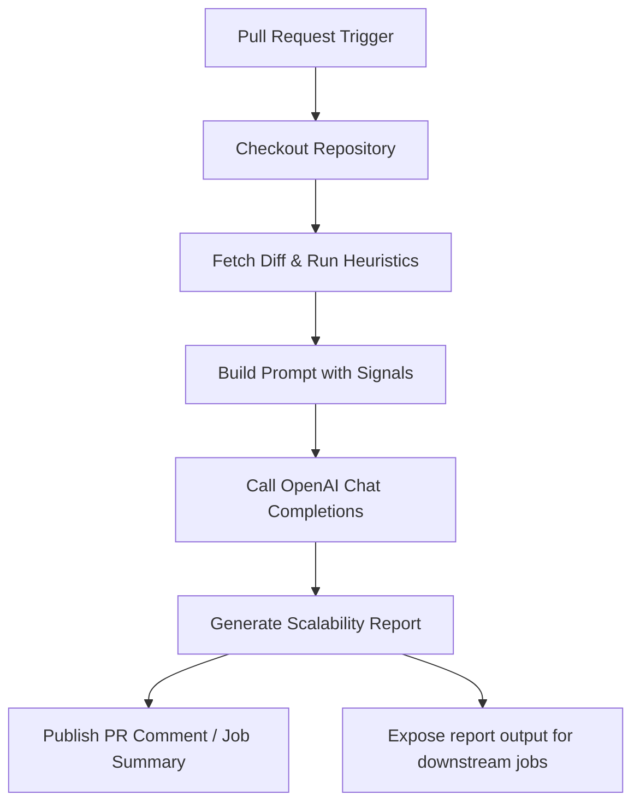

# 🚀 Scale Sentry AI

[](https://github.com/dextel2/scale-sentry-ai/stargazers)   [](https://github.com/dextel2/scale-sentry-ai/actions/workflows/ci.yml)  

*Forecast scalability problems caused by code changes before they reach production.*

## ❤️ Why You Will Love It

- 🔍 Highlights risky database operations, heavy loops, and new endpoints as soon as a pull request opens.
- 🤖 Uses OpenAI (defaults to `gpt-4o`) to simulate realistic load profiles without staging infrastructure.
- 📝 Produces reviewer-ready Markdown with predicted bottlenecks, thresholds, and recommended fixes.
- 🧰 Fits TypeScript/Next.js stacks out of the box and adapts easily to other backends.

> Scale Sentry AI turns raw diffs into a deploy-ready performance assessment.

## 🔍 How It Works

1. 📥 Fetch the pull request diff via the GitHub API.
2. 🚨 Run heuristics to spotlight hotspots (database calls, external requests, CPU loops, concurrency, etc.).
3. 🧠 Craft a prompt that blends signals, traffic assumptions, and diff context.
4. ✉️ Call the OpenAI chat completions API for a structured analysis.
5. 💬 Publish the Markdown report and expose it as an action output.



## ⚡ Quickstart Playbook

### 🛠 Option A - Inside This Repository

```yaml
name: Scalability Simulator

on:
  push:
    branches:
      - main
      - master
  pull_request:
    types: [opened, synchronize, reopened]

jobs:
  analyze:
    runs-on: ubuntu-latest
    permissions:
      contents: read
      pull-requests: read
      issues: write
    steps:
      - uses: actions/checkout@v4
      - uses: ./
        with:
          github-token: ${{ secrets.GITHUB_TOKEN }}
          openai-api-key: ${{ secrets.OPENAI_API_KEY }}
          target-language: TypeScript
          traffic-profile: 1k-100k requests per second
```

### 🌍 Option B - Share With The World

1. ✅ Commit the bundled `dist/` output and tag a release (for example `git tag v1 && git push origin v1`).
2. 📦 Consumers reference the tag in their workflow:
   ```yaml
   - name: Run Scale Sentry AI
     uses: dextel2/scale-sentry-ai@v1
     with:
       github-token: ${{ secrets.GITHUB_TOKEN }}
       openai-api-key: ${{ secrets.OPENAI_API_KEY }}
       target-language: TypeScript
       traffic-profile: 1k-100k requests per second
   ```
3. 🔐 Remind adopters to add an `OPENAI_API_KEY` repository secret and confirm the GitHub token can post comments.

## 🧾 Configuration Cheat Sheet

| Input                | Required | Default                       | What It Controls                                                                           |
| -------------------- | -------- | ----------------------------- | ------------------------------------------------------------------------------------------ |
| `github-token`       | yes      | -                             | Authorisation for GitHub API calls and optional PR commenting.                             |
| `openai-api-key`     | yes      | -                             | Secret used to call the OpenAI chat completions endpoint.                                   |
| `openai-model`       | no       | `gpt-4o`                      | Which OpenAI model to query (for example `gpt-4o-mini` for cheaper runs).                  |
| `openai-max-tokens`  | no       | `900`                         | Completion budget; reduce to control spend.                                                |
| `openai-temperature` | no       | `0.2`                         | Creativity vs. determinism balance for the model response.                                 |
| `target-language`    | no       | `TypeScript`                  | Hint about your codebase to steer the analysis tone.                                       |
| `traffic-profile`    | no       | `1k-100k requests per second` | Desired load envelope for simulation commentary.                                           |
| `post-comment`       | no       | `true`                        | Disable to skip PR comments and consume outputs only.                                      |
| `write-job-summary`  | no       | `true`                        | Disable to prevent adding the report to the job summary.                                   |

### Output

| Name     | Description                                 |
| -------- | ------------------------------------------- |
| `report` | Markdown body generated by the AI analysis |

## 🔑 How to Obtain a GitHub Token

1. Open **Settings -> Developer settings -> Personal access tokens -> Tokens (classic)**.
2. Click **Generate new token**, name it (for example `scale-sentry-ai`), and set an expiry.
3. Grant `repo` scope (or `public_repo` for public repositories). Add `workflow` if the action must trigger other workflows.
4. Generate the token and copy it immediately; GitHub will not show it again.
5. Create or reuse a repository secret named `GITHUB_TOKEN` if you need custom permissions.
6. Pass the secret into the workflow (`github-token: ${{ secrets.GITHUB_TOKEN }}`).

> Most scenarios work with GitHub's automatically provided `${{ secrets.GITHUB_TOKEN }}`. Create a personal token only when you need elevated privileges (cross-fork commenting, triggering workflows, accessing private repositories, etc.).

## 🗒 Field Notes for Better Insights

- ✂️ Diffs are truncated to 12,000 characters; the report explicitly flags when truncation happens.
- 🎯 Heuristics are intentionally opinionated—tune `HEURISTIC_CHECKS` in `src/index.ts` for your stack.
- 🔗 The Markdown output is designed for downstream automation (Slack messages, Jira tickets, dashboards, etc.).

## 🧪 Local Development Loop

1. 📦 Install dependencies with `npm install`.
2. 🏗 Build the action via `npm run build` (bundled output lands in `dist/`).
3. 👀 Use `npm run build -- --watch` during active editing.
4. ✅ Extend tests or heuristics and re-run `npm test` before committing.

## 🛡 Safety and Cost Guardrails

- 🔐 Never commit secrets—store them in repository or organisation secrets and rotate regularly.
- 💸 Cap `openai-max-tokens` or use `gpt-4o-mini` to control OpenAI spend.
- 🙅 Set `post-comment: "false"` if your review process requires manual approval before commenting.
- 🧾 Logs intentionally omit diff content and OpenAI payloads to avoid leaking sensitive data.

## 🌟 Share Your Wins

- 🧬 Fork for other ecosystems (Python, Go, JVM) with stack-specific heuristics.
- 📊 Feed real load-test telemetry into the prompt for hybrid AI plus empirical reports.
- 🤝 Open issues or pull requests with new heuristics so the community benefits.

Ready to ship? Commit `dist/`, tag a release, and let Scale Sentry AI guard your deploy runway.

